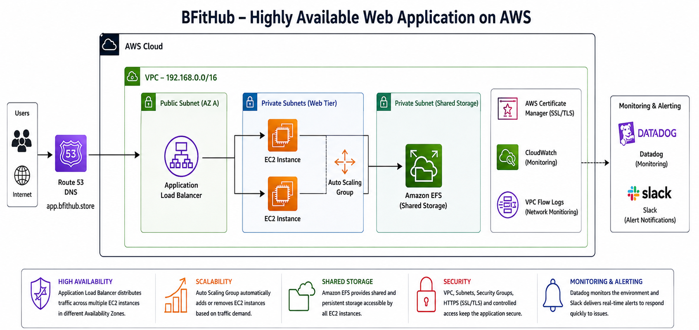

# BFitHub – Highly Available AWS Infrastructure

**Project Owner:** Bisola Adebola
**Cloud Platform:** Amazon Web Services (AWS)
**Operating System:** Ubuntu Linux
**Application:** `app.bfithub.store`
**Project Type:** Hands-on Cloud Infrastructure Deployment

---

## Project Overview

BFitHub is a highly available web application infrastructure project built on AWS to demonstrate practical cloud engineering skills in networking, compute, shared storage, load balancing, Auto Scaling, security, Linux administration, monitoring, alerting, DNS, and HTTPS.

The project was designed around an important question:

> How can a web application be designed so that it remains available, scalable, secure, observable, and easier to manage as demand changes?

The solution uses multiple AWS services working together rather than relying on a single EC2 web server.

---

## Architecture



### Request Flow

```text
Users
  ↓
DNS
  ↓
HTTPS
  ↓
Application Load Balancer
  ↓
Auto Scaling Group
  ↓
EC2 Web Servers
  ↓
Amazon EFS
```

Infrastructure monitoring and alerting follow:

```text
AWS Infrastructure
       ↓
    Datadog
       ↓
     Slack
       ↓
Administrator
```

---

## Business Problem

A web application hosted on a single server introduces several risks:

* The server can become a single point of failure.
* Increased traffic can overwhelm available capacity.
* Application files may be tied to one server.
* Infrastructure problems may not be detected quickly.
* Directly exposing servers can increase security risk.
* Manual recovery can increase downtime.

The BFitHub architecture was designed to address these concerns through high availability, load balancing, scaling, shared storage, network segmentation, monitoring, and alerting.

---

## AWS Services & Technologies

| Service / Technology      | Purpose                                     |
| ------------------------- | ------------------------------------------- |
| Amazon VPC                | Isolated network environment                |
| Public & Private Subnets  | Network segmentation                        |
| Internet Gateway          | Internet connectivity for public resources  |
| NAT Gateway               | Outbound connectivity for private resources |
| Amazon EC2                | Ubuntu application servers and Jump Server  |
| Application Load Balancer | Distributes incoming application traffic    |
| EC2 Auto Scaling          | Maintains and adjusts application capacity  |
| Amazon EFS                | Shared persistent web content               |
| Security Groups           | Controls network access                     |
| AWS Certificate Manager   | SSL/TLS certificate management              |
| VPC Flow Logs             | Network traffic visibility                  |
| Ubuntu Linux              | Server operating system                     |
| Nginx                     | Web server                                  |
| Bash                      | Server configuration automation             |
| Datadog                   | Infrastructure monitoring                   |
| Slack                     | Alert notifications                         |
| Git                       | Version control                             |
| GitHub                    | Source control and project documentation    |

---

## High Availability

The architecture reduces dependency on a single application server.

An Application Load Balancer distributes incoming requests across multiple EC2 instances.

The EC2 instances are managed through an Auto Scaling Group, providing a foundation for replacing unhealthy instances and adjusting application capacity.

Deploying resources across multiple Availability Zones further reduces dependency on a single infrastructure location.

---

## Scalability

Amazon EC2 Auto Scaling allows application capacity to respond to changing demand.

Instead of permanently relying on a fixed number of servers, the environment can increase or decrease compute capacity based on configured scaling requirements.

This provides a foundation for balancing:

**Performance + Availability + Cost**

---

## Shared Storage

Amazon EFS provides shared persistent storage for the application servers.

Instead of storing independent copies of the website on each EC2 instance, multiple servers can access the same web content.

```text
EC2 Server 1 ──┐
               ├── Amazon EFS
EC2 Server 2 ──┘
```

This is particularly useful when new instances are created through Auto Scaling.

---

## Security

Security was incorporated at multiple layers of the architecture.

Key measures include:

* Public and private subnet separation
* Security Group restrictions
* Controlled SSH access through a Jump/Bastion Server
* Web servers positioned behind the Application Load Balancer
* NFS access restricted for Amazon EFS
* HTTPS encryption
* SSL/TLS certificate management
* Controlled routing between network components

The project reinforced the principle of allowing only the network access required for each component.

---

## Monitoring & Alerting

Datadog was integrated to provide infrastructure monitoring and operational visibility.

Slack was used as the alert notification destination.

```text
Infrastructure Event
        ↓
     Datadog
        ↓
   Alert Triggered
        ↓
      Slack
        ↓
 Administrator
```

This demonstrates the importance of not only deploying infrastructure but also making it observable.

---

## Linux & Automation

Ubuntu Linux was used for the EC2 instances.

Bash and EC2 User Data were used to automate server configuration tasks including:

* Hostname configuration
* Operating system updates
* Package installation
* Nginx installation
* Nginx service configuration
* EFS/NFS dependencies
* EFS mounting
* `/etc/fstab` configuration
* File ownership configuration
* Datadog Agent installation

Example scripts are available in:

* [`jump-server-user-data.sh`](scripts/jump-server-user-data.sh)
* [`web-server-user-data.sh`](scripts/web-server-user-data.sh)

> Sensitive credentials and environment-specific secrets are intentionally excluded from the repository.

---

## Skills Demonstrated

### AWS

VPC • EC2 • EFS • Application Load Balancer • Auto Scaling • NAT Gateway • Internet Gateway • Security Groups • ACM • VPC Flow Logs

### Networking

CIDR Planning • Subnets • Routing • HTTP/HTTPS • DNS • NFS • Network Security

### Linux

Ubuntu • Nginx • Package Management • File Systems • Permissions • `/etc/fstab` • Bash

### Operations

Datadog • Slack Alerting • Monitoring • Troubleshooting

### Dev Tools

Git • GitHub • VS Code • Markdown • Bash

### Project Skills

Technical Documentation • Infrastructure Design • Troubleshooting • Security Awareness • Business-Value Analysis

---

## Challenges & Troubleshooting

Several real-world challenges were encountered during the deployment, including:

* EFS/NFS connectivity
* Security Group configuration
* DNS propagation
* SSL/TLS certificate validation
* HTTPS listener configuration
* EC2 User Data troubleshooting
* Shared web content
* Auto Scaling integration
* Monitoring and alerting

These challenges strengthened my understanding of how AWS services depend on one another.

Read the detailed troubleshooting documentation:

**[Challenges & Lessons Learned](documentation/challenges-and-lessons-learned.md)**

---

## Project Documentation

### Project Overview

Detailed explanation of the architecture, AWS services, skills demonstrated, and business value:

**[View Project Overview](documentation/project-overview.md)**

### Deployment Guide

Step-by-step documentation of the infrastructure deployment:

**[View Deployment Guide](documentation/deployment-guide.md)**

### Challenges & Lessons Learned

Problems encountered, troubleshooting approach, solutions, and lessons:

**[View Challenges & Lessons Learned](documentation/challenges-and-lessons-learned.md)**

---

## Repository Structure

```text
BFitHub-AWS-High-Availability/
│
├── architecture/
│   └── bfithub-aws-architecture.png
│
├── documentation/
│   ├── project-overview.md
│   ├── deployment-guide.md
│   └── challenges-and-lessons-learned.md
│
├── scripts/
│   ├── jump-server-user-data.sh
│   └── web-server-user-data.sh
│
├── screenshots/
│   ├── networking/
│   ├── compute/
│   ├── storage/
│   ├── load-balancing/
│   ├── auto-scaling/
│   ├── monitoring/
│   ├── dns-https/
│   └── website/
│
└── README.md
```

---

## Business Value

### High Availability

Load balancing and multiple EC2 instances reduce dependency on a single application server.

### Scalability

Auto Scaling provides the ability to adjust infrastructure capacity as application demand changes.

### Reliability

Amazon EFS provides shared application content across web servers.

### Security

Network segmentation, Security Groups, controlled administrative access, and HTTPS reduce unnecessary exposure.

### Operational Visibility

Datadog provides monitoring of the infrastructure environment.

### Faster Incident Awareness

Slack notifications help surface infrastructure alerts quickly.

### Maintainability

Bash automation and technical documentation make the environment easier to understand and reproduce.

---

## Key Lessons

This project reinforced that cloud engineering is not simply about creating AWS resources.

A reliable cloud environment requires understanding how:

**Networking + Compute + Storage + Security + Automation + Monitoring**

work together as one system.

Troubleshooting the environment also strengthened my ability to investigate problems systematically rather than treating individual AWS services in isolation.

---

## Future Improvements

Future iterations of the project could include:

* Infrastructure as Code using Terraform
* AWS CloudFormation
* CI/CD using GitHub Actions
* AWS WAF
* Automated backup and recovery
* Centralized logging
* Expanded monitoring dashboards
* Automated security checks
* Automated infrastructure testing

---

## Project Outcome

BFitHub demonstrates my hands-on experience designing and deploying AWS infrastructure with a focus on:

**High Availability • Scalability • Security • Reliability • Monitoring • Automation**

The project also demonstrates practical Linux administration, troubleshooting, technical documentation, and Git/GitHub skills.

---

## Author

**Bisola Adebola**

Cloud Computing | AWS | Linux | Cloud Infrastructure | Technical Support

**Project:** BFitHub – Highly Available AWS Infrastructure

